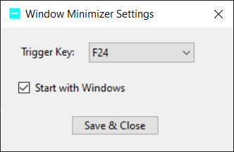

# Window Minimizer (Logitech G-HUB Workaround)

A lightweight, background Windows system tray application that minimizes the currently active window when a specific key (configurable from `F13` to `F24`) is pressed.

This project was built as a workaround for Logitech G-HUB, which removed the native "Minimize Window" command that existed in Logitech Options+. By binding a physical mouse button to an unmapped function key (like `F24`) in G-HUB, this application catches the keystroke at the OS level and minimizes the active window instantly.

---

## Features
* **Configurable Keybinds:** Choose any key from `F13` to `F24` via the built-in settings panel to match your macro configurations.
* **Native Startup Integration:** Toggle a simple checkbox to automatically launch the application when Windows boots, without needing administrator privileges or manually managing shortcuts.
* **Minimal Footprint:** Runs quietly in the system tray next to your clock with zero background performance impact.
* **Low-Level Global Hook:** Intercepts the designated keystroke globally, regardless of which application or game is currently focused.
* **Single Executable:** Compiles to a completely standalone `.exe` file with no external dependencies.

---
## Download
Download the built exe from the [releases](https://github.com/topaz1008/WindowMinimizer/releases) page.

---
## Screenshots



---

## How to Build
A PowerShell build script is included. It automatically generates the application icon and compiles the project using the .NET 8 SDK.

You can download the .NET 8 SDK from the official [Microsoft .NET Download Page](https://dotnet.microsoft.com/en-us/download/dotnet/8.0).

1. Open PowerShell and navigate to the project folder.
2. Run the build script:
   ```powershell
   .\build.ps1
   ```
3. The compiled executable will be located in the following directory:
   ```text
   bin\Release\net8.0-windows\win-x64\publish\
   ```

---

## How to Use
1. Run `WindowMinimizerTray.exe`. A blue icon will appear in your Windows system tray.
2. **Double-click** the system tray icon (or right-click and select **Settings**) to open the configuration panel.
3. Select your preferred trigger key (default is `F24`) and check **Start with Windows** if you want the app to run automatically on boot. Click **Save & Close**.
4. Open Logitech G-HUB (or your preferred mouse utility software) and assign that exact same function key to your desired mouse button.
